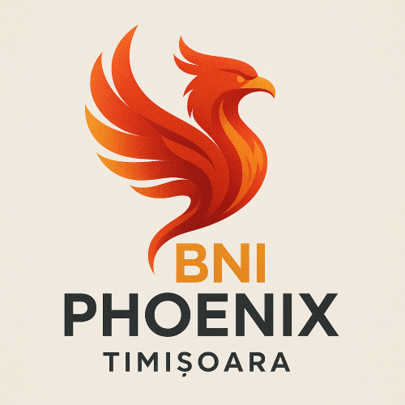

# 🍂 Recolta de Oportunități - BNI Timiș Landing Page

Un landing page modern și responsive pentru evenimentul de networking "Recolta de Oportunități" organizat de BNI Phoenix Timișoara.



## 📅 Detalii Eveniment

- **Data:** 9 octombrie 2025
- **Ora:** 18:30
- **Locația:** Valery – Moșnița Nouă, nr. 861, Timiș, România
- **Preț Early Booking:** 180 lei
- **Organizator:** BNI Phoenix Timișoara

## 🚀 Caracteristici

### ✨ Design Modern
- **Tema de toamnă** cu culori calde (roșu, portocaliu, galben)
- **Responsive design** complet pentru toate dispozitivele
- **Animații fluide** și efecte vizuale discrete
- **Typography elegantă** cu Playfair Display și Open Sans

### 🎯 Funcționalități Avansate
- **Smooth scrolling navigation** între secțiuni
- **Navigation dots** fixe pentru acces rapid
- **Section arrows** pentru navigare secvențială
- **Keyboard navigation** (Ctrl + ↑/↓)
- **Auto-scroll** opțional după 15 secunde
- **Formular de rezervare** cu validare în timp real
- **Google Maps integration** clickabilă
- **Social media optimization** completă

### 📱 Experiență Utilizator
- **Header fix** cu buton de rezervare
- **Hero section** impresionant cu SVG-uri integrate
- **Benefits cards** animate la scroll
- **Interactive map** cu redirect la Google Maps
- **Form validation** cu feedback vizual
- **Success messages** și error handling

## 🛠️ Tehnologii Folosite

- **HTML5** - Structură semantică și accessibility
- **CSS3** - Stilizare avansată cu CSS Grid și Flexbox
- **Vanilla JavaScript** - Fără dependințe externe
- **Google Fonts** - Typography premium
- **SVG Graphics** - Grafică vectorială optimizată

## 📁 Structura Proiectului

```
LandingPageConf9Oct/
├── index.html              # Pagina principală
├── style.css               # Stilizare completă
├── app.js                  # Funcționalitate JavaScript
├── images/                 # Resurse grafice
│   ├── bni-phoenix.png    # Logo pentru social media
│   ├── BNI-Timis.svg      # Logo principal
│   ├── invitatie.jpg      # Imaginea de referință
│   └── *.svg              # Elemente decorative
├── .gitignore             # Git ignore rules
└── README.md              # Documentația proiectului
```

## 🎨 Schema de Culori

```css
--primary-red: #C41E3A      /* Roșu principal BNI */
--primary-orange: #FF6B35   /* Portocaliu toamnă */
--primary-gold: #FFB347     /* Galben/auriu */
--dark-red: #8B0000         /* Roșu închis */
--cream: #FEF7F0            /* Fundal crem */
```

## 🚀 Cum să Rulezi Proiectul

### Opțiunea 1: Server HTTP simplu cu Python
```bash
cd LandingPageConf9Oct
python -m http.server 8000
```
Apoi deschide: `http://localhost:8000`

### Opțiunea 2: Live Server (VS Code Extension)
1. Instalează extensia "Live Server" în VS Code
2. Right-click pe `index.html`
3. Selectează "Open with Live Server"

### Opțiunea 3: Direct în browser
Deschide `index.html` direct în browser (unele funcționalități pot fi limitate)

## 📊 SEO și Social Media

### Meta Tags Complete
- **Open Graph** pentru Facebook, WhatsApp, LinkedIn
- **Twitter Cards** pentru Twitter
- **Structured Data** pentru Google (Schema.org)
- **Meta tags** pentru SEO

### Optimizare Performance
- **DNS prefetch** pentru resurse externe
- **Lazy loading** pentru imagini
- **Minified resources** în producție
- **Responsive images** pentru device-uri diferite

## 🎯 Funcționalități JavaScript

### Navigare
- **Smooth scroll** între secțiuni
- **Active section tracking**
- **Keyboard shortcuts** (Ctrl + Arrow keys)
- **Auto-scroll** cu reset la interacțiune

### Formular
- **Real-time validation**
- **Error messaging** cu design personalizat
- **Success confirmation** cu animații
- **Local storage** pentru demo

### Interactivitate
- **Google Maps integration**
- **Analytics tracking** events
- **Easter eggs** (Konami code)
- **Responsive animations**

## 📱 Responsive Design

### Breakpoints
- **Desktop:** 1200px+
- **Tablet:** 768px - 1199px
- **Mobile:** < 768px
- **Small Mobile:** < 480px

### Adaptări Mobile
- Navigation dots mai mici fără tooltip
- Font sizes adaptive
- Touch-friendly buttons
- Optimized spacing și padding

## 🔧 Configurare și Customizare

### Modificarea Culorilor
Editează variabilele CSS din `:root` în `style.css`:

```css
:root {
    --primary-red: #YourColor;
    --primary-orange: #YourColor;
    /* ... */
}
```

### Modificarea Textelor
Toate textele sunt în `index.html` și pot fi ușor modificate.

### Adăugarea de Secțiuni
1. Adaugă secțiunea în HTML
2. Adaugă secțiunea în array-ul `sections` din `app.js`
3. Adaugă stilizarea în `style.css`

## 📈 Analytics și Tracking

Proiectul include tracking pentru:
- **Button clicks**
- **Form submissions**
- **Scroll depth**
- **Section navigation**
- **Map interactions**

Pentru a activa analytics, adaugă Google Analytics în `<head>`.

## 🚀 Deploy pe Production

### GitHub Pages
1. Push proiectul pe GitHub
2. Activează GitHub Pages în Settings
3. Selectează branch-ul main

### Netlify
1. Conectează repository-ul GitHub
2. Deploy automat la fiecare commit
3. Custom domain disponibil

### Vercel
1. Import repository din GitHub
2. Deploy instant cu preview URLs
3. Optimizări automate

## 🤝 Contribuții

Contribuțiile sunt binevenite! Pentru modificări majore:

1. Fork repository-ul
2. Creează un branch pentru feature (`git checkout -b feature/AmazingFeature`)
3. Commit changes (`git commit -m 'Add AmazingFeature'`)
4. Push la branch (`git push origin feature/AmazingFeature`)
5. Deschide un Pull Request

## 📄 Licență

Acest proiect este proprietatea BNI Phoenix Timișoara. Toate drepturile rezervate.

## 👥 Contact

**BNI Phoenix Timișoara**
- Website: [Link către site oficial]
- Email: contact@bni-phoenix-timisoara.ro
- LinkedIn: [BNI Phoenix Timișoara]
- Facebook: [BNI Phoenix Timișoara]

---

*Dezvoltat cu ❤️ pentru comunitatea de business din Timiș*